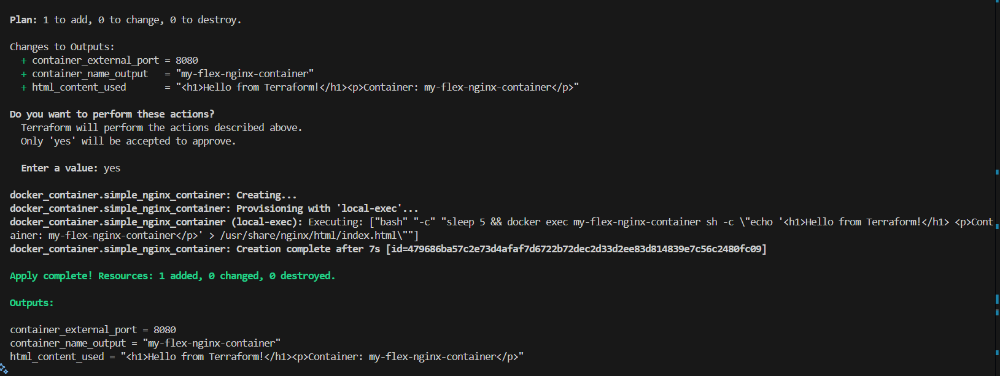
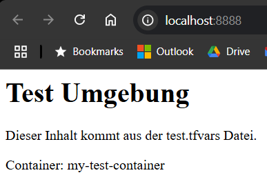
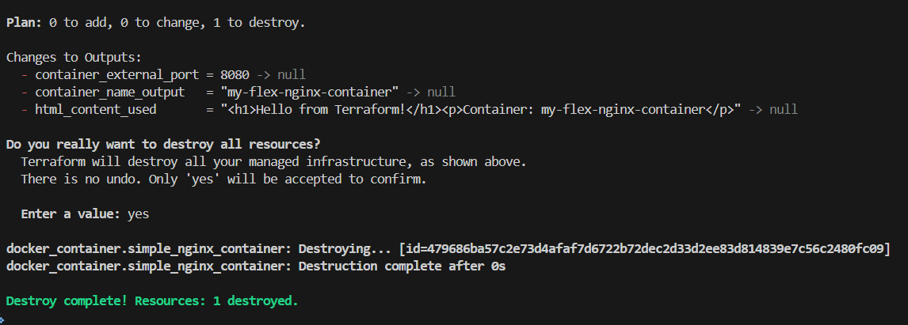

# Terraform – Nginx Deployment mit Variablen, Outputs und Provisioner

Dies ist die Abgabe zur Aufgabe **"Terraform Workflow abschließen & Konfiguration flexibel machen"**.  
Die Terraform-Konfiguration befindet sich im Ordner:  
`terraform/first-steps/`

## Inhalt

- Verwendung des Docker Providers (`kreuzwerker/docker`)
- Erstellung eines Nginx-Containers mit dynamischem HTML-Inhalt
- Nutzung von Variablen (`variables.tf`) und Outputs (`outputs.tf`)
- Konfigurierbar über `.tfvars` oder CLI
- HTML-Inhalt wird über `local-exec` Provisioner in den Container geschrieben
- Kompletter Terraform-Workflow: `init`, `plan`, `apply`, `destroy`

## Screenshots

### `terraform init`


### `terraform plan` (erste Hälfte)


### `terraform plan` (zweite Hälfte)


### `terraform apply`



### Browseransicht (`http://localhost:8888`)



### `terraform destroy`



## Variablen (test.tfvars Beispiel)

```hcl
container_name     = "my-test-container"
external_port      = 8888
nginx_html_content = "<h1>Test Umgebung</h1><p>Dieser Inhalt kommt aus der test.tfvars Datei.</p>"
```

## Ausführung
```bash
terraform init
terraform plan -var-file="test.tfvars"
terraform apply -var-file="test.tfvars"
terraform destroy -var-file="test.tfvars"
```

## Reflexionsfragen

### Was hat der Befehl terraform apply getan, als du ihn zum ersten Mal mit deiner initialen Konfiguration (ohne Variablen) ausgeführt hast?
Er hat den Container erstellt und den Zustand in der terraform.tfstate gespeichert.

### Was ist mit dem Terraform State (terraform.tfstate) passiert, nachdem du terraform apply und terraform destroy ausgeführt hast?
Nach apply wurde der aktuelle Zustand (Container existiert) gespeichert. Nach destroy wurde der Container entfernt und der State entsprechend aktualisiert.

### Wie haben die Variablen (variable {}, var.) deine Konfiguration flexibler und wiederverwendbarer gemacht, verglichen mit der initialen Konfiguration (ohne Variablen)?
Die Konfiguration kann jetzt wiederverwendet werden, ohne manuell Dateien zu ändern – Werte wie Port, Name oder HTML-Inhalt lassen sich dynamisch setzen.

### Auf welche drei Arten hast du Werte an deine Input-Variablen übergeben?  
Beschreibe kurz die Methode und ihre Priorität.
- Standardwerte in `variables.tf`
- `.tfvars` Datei (z. B. `test.tfvars`)
- Direkt über das CLI-Flag `-var`

**Priorität:** CLI > .tfvars > Default

### Was zeigen die Outputs (`output {}`, `terraform output`) an, nachdem du apply ausgeführt hast? Wofür sind sie nützlich?
Sie zeigen die konfigurierten Werte wie den Containernamen, den externen Port und den final verwendeten HTML-Inhalt. Das hilft beim Nachvollziehen und bei der automatisierten Weiterverwendung.

### Wie hast du den Inhalt der Variable `nginx_html_content` in die `index.html` Datei im laufenden Docker-Container bekommen? Welche Terraform-Funktion (Provisioner) wurde dafür genutzt?
Mit einem `local-exec` Provisioner, der ein Bash-Kommando (`docker exec`) ausführt und den HTML-Text über `echo` in eine Datei im Container schreibt.


## Hinweise

- `.terraform/` und `terraform.tfstate` sind per `.gitignore` ausgeschlossen.
- `test.tfvars` enthält keine sensiblen Daten und ist im Repo enthalten.
