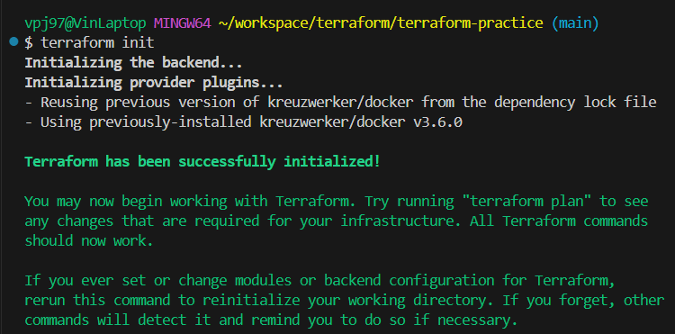
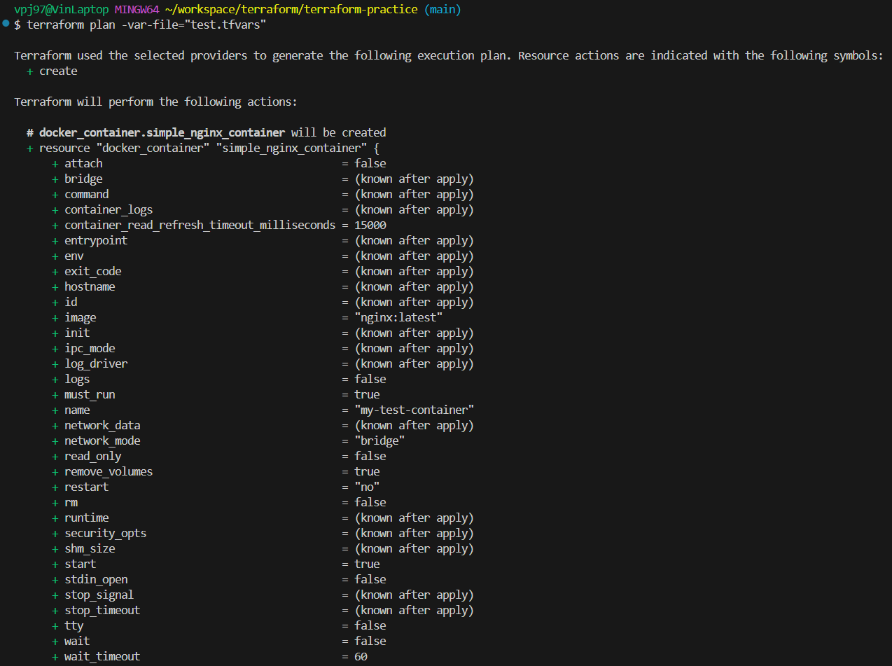
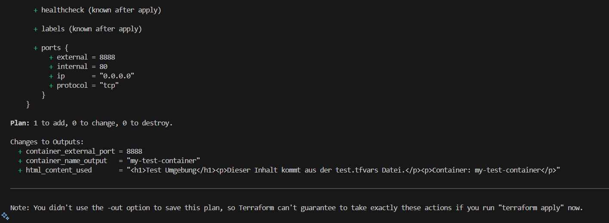

# Terraform – Erste Schritte

Dies ist die Abgabe zur Aufgabe **"Erste Schritte mit Terraform: Provider und Ressourcen definieren & planen"**.  
Die Terraform-Konfiguration befindet sich im Ordner:  
`terraform/first-steps/`

## Inhalt

- Definition eines Docker Providers (kreuzwerker/docker)
- Erstellung von zwei Ressourcen:
  - Einem `docker_image` (nginx:latest)
  - Einem `docker_container` (basierend auf dem Image)
- Durchführung der Befehle `terraform init` und `terraform plan`
- Screenshots der Ausgaben

## Screenshots

### `terraform init`

### `terraform plan` (erste Hälfte)

### `terraform plan` (zweite Hälfte)

## Reflexionsfragen

### Was ist die Rolle des provider Blocks in deiner Konfiguration?  
Der Provider definiert, wie Terraform mit der Plattform (hier Docker) kommuniziert.

### Warum ist er notwendig?  
Er stellt die Verbindung her und ermöglicht Terraform, Ressourcen zu verwalten.

### Was ist die Rolle des resource Blocks?  
Er beschreibt, welche Ressourcen Terraform erstellen oder verwalten soll.

### Was repräsentiert er im Vergleich zu einem provider?  
Provider = Verbindung, Resource = Objekt, das erstellt wird.

### Wie hast du in deiner Konfiguration eine implizite Abhängigkeit zwischen der docker_container Ressource und der docker_image Ressource erstellt?  
Durch die Referenz: `image = docker_image.nginx_image.name`.

### Warum ist es wichtig, dass Terraform diese Abhängigkeit versteht?  
Damit die Ressourcen in der richtigen Reihenfolge erstellt werden.

### Was genau bewirkt der Befehl terraform init, wenn du ihn zum ersten Mal in einem Verzeichnis ausführst?  
Er lädt benötigte Provider-Plugins und erstellt die `.terraform`-Struktur.

### Was genau zeigt der Output von terraform plan an?  
Er zeigt, welche Änderungen Terraform vornehmen würde, ohne sie tatsächlich auszuführen.

## Hinweise

- `.terraform/` und `terraform.tfstate` sind per `.gitignore` ausgeschlossen.
